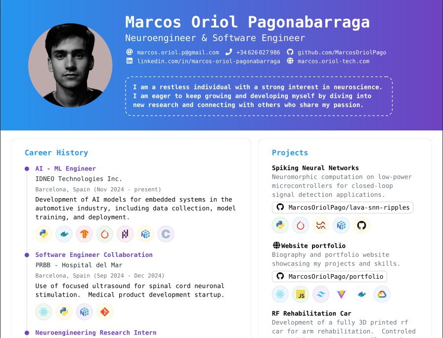

# LaTeX CV

A LaTeX template for creating professional, clean, and modern CVs. The template produces high-quality PDF output suitable for job applications, academic purposes, or professional portfolios.

---

## Preview

Below is an example of the generated CV PDF:

  
---

## Features

- Minimal and modern design.
- Fully customizable sections.
- Easy to update personal information.
- High-quality PDF output.

---

## Requirements

- LaTeX distribution (TeX Live, MiKTeX, MacTeX, etc.)
- `pdflatex` or any LaTeX editor (TeXShop, TeXstudio, Overleaf, etc.)

---

## Quick Start

1. Clone the repository:

```bash
git clone https://github.com/MarcosOriolPago/latex-cv.git
cd latex-cv
```

2. Compile the LaTeX file:
```bash
pdflatex cv.tex
```

## Customization

- Update personal information directly in cv.tex.

- Modify, add, or remove sections as needed.

- Replace photo.png with your own photo (optional).


## Directory Structure
latex-cv/<br>
├── icons <br>
├── sections<br>
├── svg-inkscape<br>
├── cv.tex<br>
├── profile.jpg<br>
├── cv.pdf<br>
└── README.md 